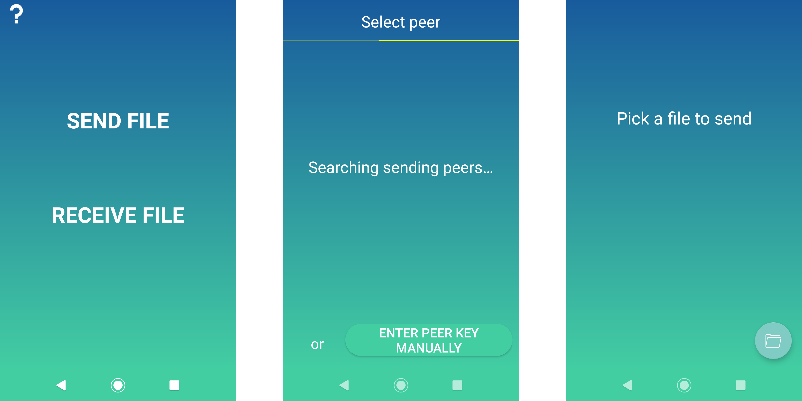
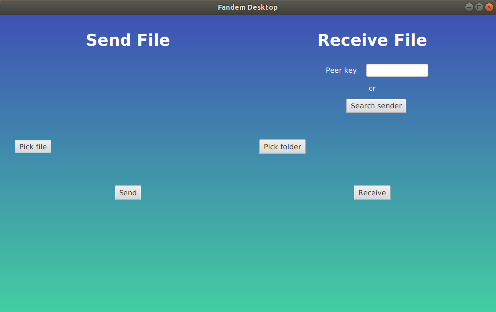

# P2P File Sharing

This project aims to transfer files from one device (computer or android smartphone) to another. It works only if the two devices are on the same local network. If one of the devices is an android smartphone, you can share data with it and connect the other device to the smartphone's data.

You can download the apps [here](https://tambapps-portfolio.herokuapp.com/fandem/) or [here](https://github.com/tambapps/P2P-File-Sharing/releases/latest)

## P2P Library

This is the library I built, used by all the apps (Android, command-line and Desktop). 
It is because of this library that we can also share files between android and desktop.

## Android app

This is the Android app that performs P2P file sharing

## Desktop app

The desktop app was developed with JavaFX and Spring Boot (for dependency injection). It was developed in Java 16.

## How it works

This project only works if the two devices are on the same local network.
This allows peers to communicate between them, without any intermediate server. Your data
goes from the sender, directly to the receiver

### Automatic peer discovery
The receiver can detect sending peers automatically. This is implemented with
UDP multicast:

The receiver register to a multicast address group, and the sender sends its peer data periodically 
to that group, using UDP packet.
